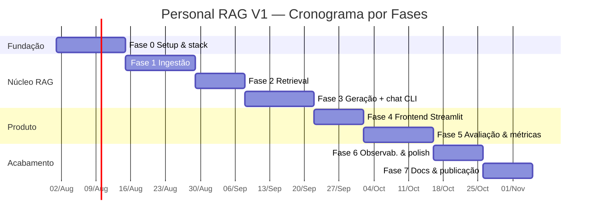

# 🗺️ Plano de Execução por Fases — Personal RAG Assistant V1

> Execução realista de um projeto de 1 semestre, feito **em paralelo** à faculdade e ao trabalho.
> São **8 fases** (Fase 0 a Fase 7). Cada fase entrega algo **funcional e demonstrável** —
> nada de "grande explosão no final". Estimativas em dias corridos assumindo ritmo sustentável
> (algumas horas por semana), não full-time.

---

## 🧭 Princípios de execução

1. **Vertical slices, não camadas isoladas.** Cada fase entrega funcionalidade ponta a ponta.
2. **Sempre demonstrável.** Ao fim de cada fase, dá pra rodar e mostrar algo.
3. **Escopo congelado.** Ideias novas viram issues do V2, não trabalho da fase atual.
4. **Commitar cedo e sempre.** Repositório público desde a Fase 0 (mostra evolução real).
5. **Medir antes de otimizar.** A Fase 5 (avaliação) informa qualquer ajuste posterior.

---

## Visão geral das fases

| Fase | Nome | Entrega central | Duração |
|------|------|-----------------|---------|
| 0 | Fundação & Setup | Stack instalada, repo, "hello LLM" | ~2 sem |
| 1 | Ingestão | Documentos viram chunks indexados | ~2 sem |
| 2 | Retrieval | Busca semântica top-k funcionando | ~1,5 sem |
| 3 | Geração + Chat | Resposta ancorada com citação (CLI) | ~2 sem |
| 4 | Frontend | Interface Streamlit de chat | ~1,5 sem |
| 5 | Avaliação | Golden set + métricas (recall/custo/latência) | ~2 sem |
| 6 | Observabilidade & Polish | Traces, testes, CI, modo local sólido | ~1,5 sem |
| 7 | Docs & Publicação | README + demo + repo público apresentável | ~1,5 sem |

---

## 🏁 Fase 0 — Fundação & Setup

**Objetivo:** ambiente de IA montado e um "hello world" que prova que cada provider responde.

**Tarefas**
- [ ] Criar repo público, `.gitignore`, LICENSE, `pyproject.toml` (uv), estrutura de pastas vazia.
- [ ] Configurar ruff + pre-commit + pytest + GitHub Actions (CI mínimo verde).
- [ ] Instalar Ollama e baixar `llama3.2` + `nomic-embed-text`; **testar que cabem na RTX 5060 8GB**.
- [ ] Criar chave grátis: **Google AI Studio (Gemini)**. Opcional: Groq, Langfuse. Preencher `.env`.
- [ ] `settings.py` (pydantic-settings) lendo `.env`.
- [ ] `common/ratelimit.py`: helper de throttle RPM + backoff/retry em 429 (usado pelos adapters de nuvem).
- [ ] Script "hello": manda 1 prompt para **Gemini, Groq e Ollama** e imprime a resposta.

**Entregáveis:** repo inicializado + CI verde + script que chama os 3 providers (todos free).

**Critério de pronto (DoD):**
- ✅ `uv sync` funciona do zero.
- ✅ Cada provider (Gemini, Groq, Ollama) responde a um prompt.
- ✅ Um 429 do free tier é tratado com backoff (não derruba o script).
- ✅ Nenhuma chave commitada.

> 💡 Risco crítico testado cedo: **o modelo local cabe na GPU?** Se não, ajuste para 1B/quantizado agora, não na Fase 6.

---

## 📥 Fase 1 — Ingestão

**Objetivo:** transformar arquivos em chunks indexados no vector store.

**Tarefas**
- [ ] `domain/models.py`: `RawDocument`, `Chunk`, `EmbeddedChunk`.
- [ ] `domain/ports.py`: interfaces `EmbeddingProvider` e `VectorStore`.
- [ ] Loaders: PDF (`pypdf`), DOCX (`python-docx`), MD/TXT. Extrair `source`, `page`, `doc_hash`.
- [ ] Chunker com `RecursiveCharacterTextSplitter` (tamanho/overlap via config).
- [ ] Adaptador `ChromaVectorStore` — **nome da coleção inclui o modelo de embedding** (`chunks__<model>`); `upsert`, `query`, `delete_by_source`.
- [ ] Adaptadores de embedding (**Gemini + Ollama**) + factory.
- [ ] `common/cache.py`: cache de embedding (chave = `hash(text)+model`) para não re-embeddar / não gastar quota à toa.
- [ ] `ingestion/pipeline.py` com **reindex incremental** por `doc_hash`.
- [ ] Comando CLI `rag ingest ./data/documents`.

**Entregáveis:** rodar `rag ingest` e ver N documentos / M chunks persistidos no Chroma.

**DoD:**
- ✅ PDF, MD, TXT **e DOCX** indexam sem erro (todos os formatos do RF-01).
- ✅ Rodar de novo não reprocessa arquivos inalterados (cache + `doc_hash`).
- ✅ A coleção reflete o modelo de embedding; consultar com embedder diferente dá erro claro (§5.6 do SDD).
- ✅ Testes unitários de chunker e loaders passando.

---

## 🔍 Fase 2 — Retrieval

**Objetivo:** dada uma pergunta, recuperar os trechos mais relevantes.

**Tarefas**
- [ ] `retrieval/retriever.py`: `embed_query` → `store.query(k)` → `RetrievedChunk[]` com score.
- [ ] `TOP_K` configurável.
- [ ] CLI `rag search "pergunta"` que imprime os chunks + score + fonte (debug).
- [ ] Teste de integração: ingerir doc de exemplo e recuperar o chunk certo.

**Entregáveis:** `rag search` retorna trechos coerentes com a pergunta.

**DoD:**
- ✅ Para perguntas óbvias, o chunk correto aparece no top-5.
- ✅ Teste de integração ingest→retrieve verde (store em memória).

---

## 💬 Fase 3 — Geração + Chat (CLI)

**Objetivo:** resposta em linguagem natural **ancorada** nos trechos, com **citação**.

**Tarefas**
- [ ] `domain/ports.py`: interface `LLMProvider` + `LLMResponse` (com tokens).
- [ ] Adaptadores de LLM (**Gemini, Groq, Ollama**) + factory, com retry/backoff da `common/ratelimit.py` nos de nuvem. Fallback opcional Gemini→Groq em quota estourada.
- [ ] `rag/prompts.py`: template com regras (usar só o contexto; dizer "não sei"; citar por número).
- [ ] `rag/citations.py`: mapear resposta → fontes (source + chunk_index).
- [ ] `rag/pipeline.py`: `RAGPipeline.ask()` orquestrando tudo. Suporte a **streaming**.
- [ ] CLI `rag ask "pergunta"` com resposta + fontes.
- [ ] Tratar o caso "sem contexto relevante" (responder que não encontrou).

**Entregáveis:** `rag ask` responde citando o arquivo/trecho de origem, em cloud e local.

**DoD:**
- ✅ Resposta sempre traz ao menos uma fonte quando há contexto.
- ✅ Quando não há contexto, responde "não encontrei nos documentos".
- ✅ Funciona trocando `LLM_PROVIDER` entre gemini/groq/ollama só no `.env`.

---

## 🖥️ Fase 4 — Frontend (Streamlit)

**Objetivo:** interface de chat usável (o que aparece no GIF do README).

**Tarefas**
- [ ] `app/streamlit_app.py` com abas: **Chat**, **Ingestão**, **Métricas** (placeholder).
- [ ] Chat com histórico de sessão + streaming da resposta.
- [ ] Fontes exibidas de forma expansível (mostrar o trecho citado).
- [ ] Sidebar: seletor de modo (nuvem/local) e de provider.
- [ ] Aba Ingestão: selecionar pasta / upload + botão "Indexar" com feedback.

**Entregáveis:** app web rodando em `localhost` com chat funcional.

**DoD:**
- ✅ Dá para perguntar, ver a resposta em streaming e abrir as fontes.
- ✅ Trocar de modo no sidebar funciona sem reiniciar.

---

## 📊 Fase 5 — Avaliação & Métricas

**Objetivo:** o diferencial do projeto — **medir** qualidade, custo e latência.

**Tarefas**
- [ ] `scripts/build_golden_set.py` + `evaluation/golden_set.json` (**30 perguntas** com fonte esperada).
- [ ] `evaluation/metrics.py`: **Recall@5**, tokens/query, **custo calculado** (USD equiv. tier pago), latência (retrieval vs geração).
- [ ] `evaluation/evaluator.py`: roda o golden set ponta a ponta com `temperature=0` + modelo pinado (reproduzível) e usando o **cache** (reruns não gastam quota); loga queries que consumiram RPD.
- [ ] `evaluation/report.py`: gera `report.md` + `report.json`.
- [ ] CLI `rag eval`.
- [ ] Aba Métricas no Streamlit: rodar eval + gráficos.
- [ ] `docs/EVALUATION.md` explicando a metodologia.

**Entregáveis:** relatório com números reais nuvem vs local.

**DoD:**
- ✅ `rag eval` produz Recall@5, tokens/query, custo *calculado* e latência média (custo real = $0).
- ✅ Rerun do eval não estoura a quota do free tier (cache funcionando).
- ✅ Recall@5 ≥ 0,80 (senão, iterar chunking/top_k — é para isso que serve a métrica).
- ✅ Números colados no README.

---

## 🔭 Fase 6 — Observabilidade & Polish

**Objetivo:** deixar o sistema confiável e o modo local sólido.

**Tarefas**
- [ ] `observability/tracer.py`: **Langfuse (opcional)** tracando cada etapa; **sem keys → trace JSON local** em `data/traces/`.
- [ ] Logging estruturado.
- [ ] Fechar cobertura de testes das camadas de domínio e pipeline (unit + contract) — **CI só com fakes, sem API real nem quota**.
- [ ] Endurecer o **modo 100% local** (garantir zero chamadas externas).
- [ ] Endurecer resiliência de quota: backoff/retry e fallback Gemini→Groq testados.
- [ ] Tratamento de erros amigável (arquivo corrompido, provider fora, quota estourada, etc.).
- [ ] CI rodando lint + testes em cada PR.

**Entregáveis:** traces visíveis (Langfuse ou JSON local) + suíte de testes verde no CI.

**DoD:**
- ✅ Cada query gera um trace consultável (mesmo sem Langfuse).
- ✅ Modo local não faz nenhuma requisição de rede (verificado).
- ✅ CI verde sem tocar em API paga/quota (fakes).

---

## 📚 Fase 7 — Documentação & Publicação

**Objetivo:** transformar o projeto em **peça de portfólio** que recruta.

**Tarefas**
- [ ] README final com screenshots + **GIF de uso** (`docs/assets/demo.gif`).
- [ ] Métricas reais preenchidas no README.
- [ ] Mover SDD, Diagramas, Estrutura, Plano e Evaluation para `docs/`.
- [ ] Revisar textos, badges, licença.
- [ ] Post técnico no LinkedIn contando o que construiu e aprendeu.
- [ ] Atualizar LinkedIn: "AI Engineer | Building with LLMs".
- [ ] (Opcional) considerar versão EN do README para o público US.

**Entregáveis:** repo público apresentável + post técnico.

**DoD (gate de saída do 1º semestre):**
- ✅ Repositório público com README detalhado e demo.
- ✅ Métricas publicadas.
- ✅ Funciona em modo nuvem e local.
- ✅ CI verde.
- ✅ Post de divulgação feito.

---

## 📅 Cronograma (Gantt)

> As datas são âncora — ajuste o `2026-08-01` para o início real do seu 1º semestre.

---

## 🎯 Marcos que importam

| Marco | Acontece em |
|-------|-------------|
| Primeiro "hello LLM" nos 3 providers | Fim da Fase 0 |
| Primeiro `rag ask` respondendo com fonte | Fim da Fase 3 |
| Primeira demo visual (Streamlit) | Fim da Fase 4 |
| Primeiras **métricas reais** | Fim da Fase 5 |
| ⭐ **Repo público + README + post** (gate do semestre) | Fim da Fase 7 |

---

## 🔄 Ponte para o V2 (2º semestre)

Cada item abaixo já tem seu ponto de extensão preparado no código do V1:

| Extensão V2 | Onde encaixa |
|-------------|--------------|
| Hybrid search (BM25 + dense) | Novo retriever atrás da mesma interface |
| Reranker (Cohere/cross-encoder) | Passo extra no `RAGPipeline` pós-retrieval |
| Eval suite (Ragas/TruLens, MRR/NDCG/faithfulness) | Expande `evaluation/metrics.py` |
| pgvector | Implementar `pgvector_store.py` (stub já existe) |
| Frontend Next.js | Substitui a camada `app/`, pipeline intacto |

> É por isso que o V1 foi desenhado com Ports & Adapters: o V2 **evolui**, não reescreve.

---

*Plano alinhado ao SDD (doc 01) e à estrutura (doc 04). Documento vivo — marque as caixas conforme avança.*
