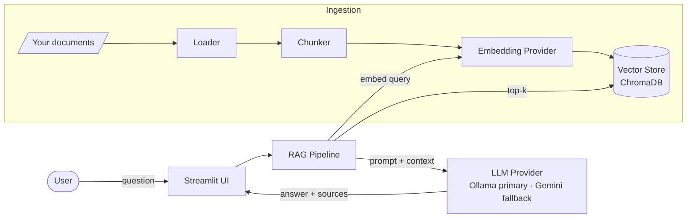

# 🧠 Personal RAG Assistant

> A local AI assistant that **answers questions about your own documents** —
> with source citations, a fully offline mode, and real metrics for quality, cost, and latency.

<p align="center">
  <a href="https://github.com/mathfrancisco/Personal-RAG-Assistant/actions/workflows/ci.yml"></a>
  
  
  
  
</p>

> 🇧🇷 Leia em **[Português](README.md)**.

---

## ✨ What it is

**Personal RAG Assistant** indexes a folder of your documents (PDF, Markdown, TXT, DOCX) and
lets you chat with them. Every answer is **grounded in your files** and comes with the **cited
source** — no untraceable hallucinations. It runs **100% locally by default** (Ollama via Docker +
Llama 3.2 — $0, no quota, nothing leaves your machine) and can optionally use the **Google Gemini
free tier** as a generation fallback. Runs with **zero API keys** by default. Project cost: **$0**.

Built following a full SDD ([`docs/SDD.md`](docs/SDD.md)) with a provider-agnostic architecture —
swapping the embedding model, LLM, or vector store is a configuration change.

---

## 🎬 Demo

> _(insert usage GIF: ask a question, get an answer with a cited source)_


---

## 🚀 Features

- 📄 **Multi-format ingestion** — PDF, Markdown, TXT, DOCX.
- 🔍 **Semantic search** — retrieves the most relevant passages (top-k).
- 💬 **Cited answers** — every answer points to the source file + passage.
- 🔒 **`local` mode** — Ollama (via Docker) + Llama 3.2, zero external calls, no quota (default).
- ☁️ **`hybrid` mode** — Ollama primary + Google Gemini (free tier) as an optional generation fallback.
- 💸 **$0 cost** — runs fully local via Ollama; the Gemini fallback (free tier) is also $0. USD cost is *calculated* for reference.
- ♻️ **Incremental reindexing** — only reprocesses what changed (file hash).
- 📊 **Built-in metrics** — `rag eval` measures Recall@k, tokens/query, calculated cost, and latency (retrieval vs generation) over a golden set.
- 🔭 **Observability** — end-to-end trace per query: **local JSON** by default (`data/traces/`), **Langfuse** optional.
- 🧩 **Provider-agnostic** — Ports & Adapters architecture (swap embedding/LLM/vector store = change config).

---

## 🏗️ Architecture (quick view)



> Full diagrams (sequence, data, classes) in [`docs/DIAGRAMS.md`](docs/DIAGRAMS.md).

---

## 🧰 Stack

| Layer | Technology |
|--------|-----------|
| Language | Python 3.11+ |
| Orchestration | LangChain |
| Vector store | ChromaDB (local) |
| Embeddings | `nomic-embed-text` (Ollama, local) |
| LLM | Ollama (llama3.2:3b, local/Docker) — primary · Gemini free = generation fallback |
| Frontend | Streamlit |
| Observability | Local JSON (default) · Langfuse (optional) · structlog |
| Quality | pytest · ruff · pre-commit · GitHub Actions |
| Deps | uv |

---

## ⚡ Quickstart

### Prerequisites
- Python 3.11+
- [uv](https://github.com/astral-sh/uv) installed
- **Docker** (for Ollama)
- **Ollama (required, primary):** runs via Docker — `make ollama-up && make ollama-pull` (pulls `llama3.2:3b` + `nomic-embed-text`). No API key needed.
- **Gemini (optional, only for the `hybrid` fallback):** a key from [Google AI Studio](https://aistudio.google.com/apikey) (free tier).

### 1. Clone and install
```bash
git clone https://github.com/mathfrancisco/Personal-RAG-Assistant.git
cd Personal-RAG-Assistant
uv sync
```

### 2. Start Ollama (Docker) — primary
```bash
make ollama-up      # or: docker compose up -d
make ollama-pull    # pulls llama3.2:3b + nomic-embed-text
```

### 3. Configure
```bash
cp .env.example .env
# runs 100% local by default; optional: add GEMINI_API_KEY for the fallback (RAG_MODE=hybrid)
```

### 4. Index your documents
```bash
# drop files into ./data/documents/ and run:
uv run rag ingest ./data/documents
```

### 5. Ask
```bash
# via CLI:
uv run rag ask "What is the delivery deadline described in contract X?"

# or via the web UI:
uv run streamlit run src/rag_assistant/app/streamlit_app.py
```

---

## 🎛️ CLI

```bash
uv run rag config                 # show effective config (no secrets)
uv run rag ingest ./data/documents
uv run rag search "question"      # debug: top-k passages + score + source
uv run rag ask "question" --stream
uv run rag eval                   # golden set → report.md/json
```

> ⚠️ Changing `EMBEDDING_PROVIDER` changes the vector space → **reindex** (`rag ingest` again).
> Embeddings from different models are not compatible.

---

## 📊 Metrics (example — fill in with real results)

The repo ships an **example** `evaluation/golden_set.json` (format only). Build your own golden set
(≥ 30 questions over your corpus), validate it, and run the evaluation:
```bash
uv run python scripts/build_golden_set.py   # validates schema/coverage
uv run rag eval                              # writes evaluation/reports/report.md + .json
```

| Metric | Gemini fallback (free) | Local Ollama (llama3.2:3b) |
|---------|-------------------------:|-----------------------:|
| Avg latency | _fill_ ms | _fill_ ms |
| Avg tokens/query | _fill_ | _fill_ |
| Real cost/query | **$0.00** (free tier) | **$0.00** (local) |
| *Calculated* cost/query | $ _fill_ (paid-tier equiv.) | — |
| Recall@5 | _fill_ | _fill_ |

> Evaluation methodology in [`docs/EVALUATION.md`](docs/EVALUATION.md).

---

## 📁 Project structure

```
personal-rag-assistant/
├── src/rag_assistant/   # ingestion · embeddings · vectorstore · retrieval · rag · llm · evaluation · observability · app
├── data/                # documents, index, cache, traces (git-ignored)
├── tests/               # unit + integration (fakes/local Chroma only — no network)
├── evaluation/          # golden_set.json + reports/ (git-ignored)
├── scripts/             # hello.py · build_golden_set.py · check_links.py
├── docs/                # SDD, diagrams, EVALUATION, PUBLISHING, retros
└── ...                  # pyproject, Makefile, docker-compose, CI
```

> Full annotated tree in [`docs/PROJECT_STRUCTURE.md`](docs/PROJECT_STRUCTURE.md).

---

## 🗺️ Roadmap

- [x] **V1** — core RAG, source citations, local/hybrid modes, essential metrics.
- [ ] **V2** — hybrid search (BM25 + dense), reranker, full eval suite (Ragas/TruLens), dashboard.
- [ ] **V3** — pgvector migration, deploy, Next.js frontend.

---

## 📄 License

MIT © Matheus Francisco
