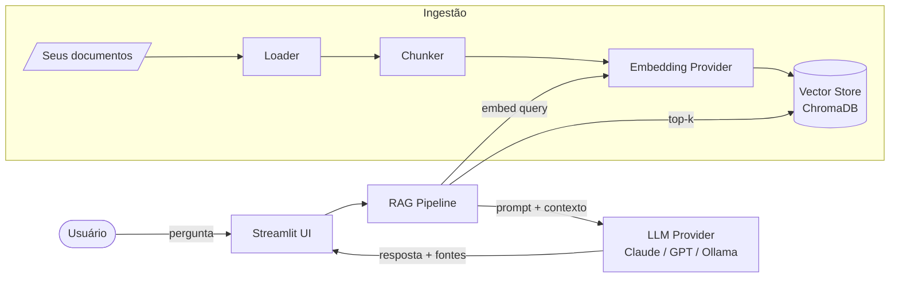

# 🧠 Personal RAG Assistant

> Um assistente de IA local que **responde perguntas sobre os seus próprios documentos** —
> com citação de fontes, modo 100% offline e métricas reais de qualidade, custo e latência.

<p align="center">
  
  
  
  
  
</p>

> 🇬🇧 **Nota estratégica:** para o portfólio público (alvo: mercado US), considere manter este README
> em **inglês**. Este arquivo está em PT-BR para o planejamento; posso gerar a versão EN quando quiser.

---

## ✨ O que é

**Personal RAG Assistant** indexa uma pasta de documentos seus (PDF, Markdown, TXT, DOCX) e
permite conversar com eles. Cada resposta é **ancorada nos seus arquivos** e vem com a **fonte
citada** — nada de alucinação sem rastro. Roda com modelos na nuvem (Claude / GPT-4o) ou
**100% localmente** (Ollama + Llama 3.2), sem enviar nada para fora.

Projeto construído seguindo um **SDD completo** ([`docs/SDD.md`](docs/SDD.md)) com arquitetura
provider-agnostic — trocar embedding, LLM ou vector store é uma mudança de configuração.

---

## 🎬 Demo

> _(inserir GIF de uso: fazer uma pergunta e receber resposta com fonte citada)_


---

## 🚀 Features

- 📄 **Ingestão multi-formato** — PDF, Markdown, TXT, DOCX.
- 🔍 **Busca semântica** — recupera os trechos mais relevantes (top-k).
- 💬 **Respostas com citação** — toda resposta aponta arquivo + trecho de origem.
- 🔒 **Modo local** — Ollama + Llama 3.2, zero chamadas externas.
- ☁️ **Modo nuvem** — Claude ou GPT-4o para respostas mais fortes.
- ♻️ **Reindexação incremental** — só reprocessa o que mudou (hash de arquivo).
- 📊 **Métricas embutidas** — latência, custo/query e Recall@5 num golden set de 30 perguntas.
- 🔭 **Observabilidade** — trace ponta a ponta via Langfuse.
- 🧩 **Provider-agnostic** — arquitetura Ports & Adapters.

---

## 🏗️ Arquitetura (visão rápida)



> Diagramas completos (sequência, dados, classes) em [`docs/DIAGRAMS.md`](docs/DIAGRAMS.md).

---

## 🧰 Stack

| Camada | Tecnologia |
|--------|-----------|
| Linguagem | Python 3.11+ |
| Orquestração | LangChain |
| Vector store | ChromaDB (local) |
| Embeddings | OpenAI `text-embedding-3-small` / `nomic-embed-text` (Ollama) |
| LLM | Claude · GPT-4o · Llama 3.2 (Ollama) |
| Frontend | Streamlit |
| Observabilidade | Langfuse |
| Qualidade | pytest · ruff · pre-commit |
| Deps | uv |

---

## ⚡ Quickstart

### Pré-requisitos
- Python 3.11+
- [uv](https://github.com/astral-sh/uv) instalado
- (Opcional, modo local) [Ollama](https://ollama.com) com `llama3.2` e `nomic-embed-text` baixados

### 1. Clonar e instalar
```bash
git clone https://github.com/<seu-user>/personal-rag-assistant.git
cd personal-rag-assistant
uv sync
```

### 2. Configurar
```bash
cp .env.example .env
# edite .env com suas chaves (ou deixe em modo local)
```

### 3. Indexar seus documentos
```bash
# coloque arquivos em ./data/documents/ e rode:
uv run rag ingest ./data/documents
```

### 4. Perguntar
```bash
# via CLI:
uv run rag ask "Qual o prazo de entrega descrito no contrato X?"

# ou via interface web:
uv run streamlit run src/app/streamlit_app.py
```

---

## 🎛️ Configuração (`.env`)

```env
# Modo: "cloud" ou "local"
RAG_MODE=cloud

# Providers (cloud)
OPENAI_API_KEY=sk-...
ANTHROPIC_API_KEY=sk-ant-...
LLM_PROVIDER=anthropic          # anthropic | openai | ollama
EMBEDDING_PROVIDER=openai       # openai | ollama

# Chunking
CHUNK_SIZE=800
CHUNK_OVERLAP=120
TOP_K=5

# Observabilidade
LANGFUSE_PUBLIC_KEY=...
LANGFUSE_SECRET_KEY=...
```

---

## 📊 Métricas (exemplo — preencher com resultados reais)

Rode a avaliação sobre o golden set:
```bash
uv run rag eval
```

| Métrica | Modo nuvem (Claude) | Modo local (Llama 3.2) |
|---------|--------------------:|-----------------------:|
| Latência média | _preencher_ ms | _preencher_ ms |
| Custo médio/query | $ _preencher_ | $0,00 |
| Recall@5 (30 perguntas) | _preencher_ | _preencher_ |

> A metodologia de avaliação está em [`docs/EVALUATION.md`](docs/EVALUATION.md).

---

## 📁 Estrutura do projeto

```
personal-rag-assistant/
├── src/            # código (ingestão, retrieval, rag, eval, app)
├── data/           # documentos e vector store (git-ignored)
├── tests/          # testes automatizados
├── evaluation/     # golden set + relatórios
├── docs/           # SDD, diagramas, avaliação
└── ...             # config, CI, pyproject
```

> Árvore completa e comentada em [`docs/PROJECT_STRUCTURE.md`](docs/PROJECT_STRUCTURE.md).

---

## 🗺️ Roadmap

- [x] **V1** — RAG básico, citação de fontes, modo local/nuvem, métricas essenciais.
- [ ] **V2** — Hybrid search (BM25 + dense), reranker, eval suite completo (Ragas/TruLens), dashboard.
- [ ] **V3** — migração para pgvector, deploy, frontend Next.js.

---

## 🧑‍💻 Motivação

Projeto bandeira do 1º semestre do meu roadmap de transição para **AI Engineering**. Serve tanto
como ferramenta pessoal quanto como demonstração pública de como projeto, meço e evoluo um
sistema RAG de ponta a ponta.

---

## 📄 Licença

MIT © Matheus
