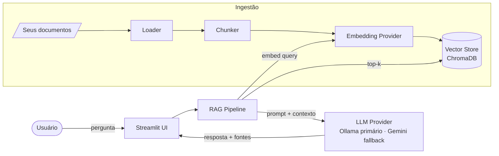

# 🧠 Personal RAG Assistant

> Um assistente de IA local que **responde perguntas sobre os seus próprios documentos** —
> com citação de fontes, modo 100% offline e métricas reais de qualidade, custo e latência.

<p align="center">
  
  
  
  
  
</p>

> 🇬🇧 **Nota estratégica:** para o portfólio público (alvo: mercado US), considere manter este README
> em **inglês**. Este arquivo está em PT-BR para o planejamento; posso gerar a versão EN quando quiser.

---

## ✨ O que é

**Personal RAG Assistant** indexa uma pasta de documentos seus (PDF, Markdown, TXT, DOCX) e
permite conversar com eles. Cada resposta é **ancorada nos seus arquivos** e vem com a **fonte
citada** — nada de alucinação sem rastro. Roda **100% local por padrão** (Ollama via Docker + Llama 3.2,
$0, sem quota, sem enviar nada para fora) e pode usar o **Google Gemini free tier** como fallback de
geração opcional. Roda com **zero chaves de API** por padrão. Custo do projeto: **$0**.

Projeto construído seguindo um **SDD completo** ([`docs/SDD.md`](docs/SDD.md)) com arquitetura
provider-agnostic — trocar embedding, LLM ou vector store é uma mudança de configuração.

---

## 🎬 Demo

> _(inserir GIF de uso: fazer uma pergunta e receber resposta com fonte citada)_


---

## 🚀 Features

- 📄 **Ingestão multi-formato** — PDF, Markdown, TXT, DOCX.
- 🔍 **Busca semântica** — recupera os trechos mais relevantes (top-k).
- 💬 **Respostas com citação** — toda resposta aponta arquivo + trecho de origem.
- 🔒 **Modo `local`** — Ollama (via Docker) + Llama 3.2, zero chamadas externas, sem quota (default).
- ☁️ **Modo `hybrid`** — Ollama primário + Google Gemini (free tier) como fallback de geração opcional.
- 💸 **Custo $0** — roda 100% local via Ollama; o fallback Gemini (free tier) também é $0. Custo em USD é *calculado* para referência.
- ♻️ **Reindexação incremental** — só reprocessa o que mudou (hash de arquivo).
- 📊 **Métricas embutidas** — latência, tokens/query, custo calculado e Recall@5 num golden set de 30 perguntas.
- 🔭 **Observabilidade** — trace ponta a ponta via Langfuse.
- 🧩 **Provider-agnostic** — arquitetura Ports & Adapters.

---

## 🏗️ Arquitetura (visão rápida)



> Diagramas completos (sequência, dados, classes) em [`docs/DIAGRAMS.md`](docs/DIAGRAMS.md).

---

## 🧰 Stack

| Camada | Tecnologia |
|--------|-----------|
| Linguagem | Python 3.11+ |
| Orquestração | LangChain |
| Vector store | ChromaDB (local) |
| Embeddings | `nomic-embed-text` (Ollama, local) |
| LLM | Ollama (llama3.2:3b, local/Docker) — primário · Gemini free = fallback de geração |
| Frontend | Streamlit |
| Observabilidade | Langfuse |
| Qualidade | pytest · ruff · pre-commit |
| Deps | uv |

---

## ⚡ Quickstart

### Pré-requisitos
- Python 3.11+
- [uv](https://github.com/astral-sh/uv) instalado
- **Docker** (para o Ollama)
- **Ollama (obrigatório, primário):** roda via Docker — `make ollama-up && make ollama-pull` (baixa `llama3.2:3b` + `nomic-embed-text`). Não precisa de nenhuma chave de API.
- **Gemini (opcional, só para o fallback do modo `hybrid`):** chave da [Google AI Studio](https://aistudio.google.com/apikey) (free tier).

### 1. Clonar e instalar
```bash
git clone https://github.com/mathfrancisco/Personal-RAG-Assistant.git
cd Personal-RAG-Assistant
uv sync
```

### 2. Subir o Ollama (Docker) — primário
```bash
make ollama-up      # ou: docker compose up -d
make ollama-pull    # baixa llama3.2:3b + nomic-embed-text
```

### 3. Configurar
```bash
cp .env.example .env
# roda 100% local por padrão; opcional: adicione GEMINI_API_KEY p/ fallback (RAG_MODE=hybrid)
```

### 4. Indexar seus documentos
```bash
# coloque arquivos em ./data/documents/ e rode:
uv run rag ingest ./data/documents
```

### 5. Perguntar
```bash
# via CLI:
uv run rag ask "Qual o prazo de entrega descrito no contrato X?"

# ou via interface web:
uv run streamlit run src/rag_assistant/app/streamlit_app.py
```

---

## 🎛️ Configuração (`.env`)

```env
# Modo: "local" (só Ollama, offline) ou "hybrid" (Ollama primário + Gemini fallback)
RAG_MODE=local

# Providers. Primário = Ollama (local, $0, sem quota).
LLM_PROVIDER=ollama          # ollama | gemini
EMBEDDING_PROVIDER=ollama    # ollama | gemini
LLM_FALLBACK_PROVIDER=gemini # usado só em RAG_MODE=hybrid (best-effort)

# Ollama (via Docker — ver docker-compose.yml)
OLLAMA_BASE_URL=http://localhost:11434
OLLAMA_LLM_MODEL=llama3.2:3b        # leve: qwen2.5:1.5b | gemma2:2b | llama3.2:1b
OLLAMA_EMBED_MODEL=nomic-embed-text

# Gemini free tier — OPCIONAL, só para fallback (RAG_MODE=hybrid). Sem isso, roda 100% local.
GEMINI_API_KEY=
GEMINI_LLM_MODEL=gemini-2.5-flash-lite
GEMINI_EMBED_MODEL=text-embedding-004

# Chunking / retrieval
CHUNK_SIZE=800
CHUNK_OVERLAP=120
TOP_K=5

# Persistência local
CHROMA_PATH=./data/chroma
CACHE_PATH=./data/cache

# Observabilidade OPCIONAL — vazio => trace JSON local em ./data/traces
LANGFUSE_PUBLIC_KEY=
LANGFUSE_SECRET_KEY=
```

> ⚠️ Trocar `EMBEDDING_PROVIDER` muda o espaço vetorial → **reindexe** (`rag ingest` de novo). Embeddings de modelos diferentes não são compatíveis.

---

## 📊 Métricas (exemplo — preencher com resultados reais)

Rode a avaliação sobre o golden set:
```bash
uv run rag eval
```

| Métrica | Fallback Gemini (free) | Local Ollama (llama3.2:3b) |
|---------|-------------------------:|-----------------------:|
| Latência média | _preencher_ ms | _preencher_ ms |
| Tokens médios/query | _preencher_ | _preencher_ |
| Custo real/query | **$0,00** (free tier) | **$0,00** (local) |
| Custo *calculado*/query | $ _preencher_ (equiv. tier pago) | — |
| Recall@5 (30 perguntas) | _preencher_ | _preencher_ |

> A metodologia de avaliação está em [`docs/EVALUATION.md`](docs/EVALUATION.md).

---

## 📁 Estrutura do projeto

```
personal-rag-assistant/
├── src/            # código (ingestão, retrieval, rag, eval, app)
├── data/           # documentos e vector store (git-ignored)
├── tests/          # testes automatizados
├── evaluation/     # golden set + relatórios
├── docs/           # SDD, diagramas, avaliação
└── ...             # config, CI, pyproject
```

> Árvore completa e comentada em [`docs/PROJECT_STRUCTURE.md`](docs/PROJECT_STRUCTURE.md).

---

## 🗺️ Roadmap

- [x] **V1** — RAG básico, citação de fontes, modo local/hybrid, métricas essenciais.
- [ ] **V2** — Hybrid search (BM25 + dense), reranker, eval suite completo (Ragas/TruLens), dashboard.
- [ ] **V3** — migração para pgvector, deploy, frontend Next.js.

---

## 🧑‍💻 Motivação

Projeto bandeira do 1º semestre do meu roadmap de transição para **AI Engineering**. Serve tanto
como ferramenta pessoal quanto como demonstração pública de como projeto, meço e evoluo um
sistema RAG de ponta a ponta.

---

## 📄 Licença

MIT © Matheus
