# 📊 Diagramas — Personal RAG Assistant V1

> Todos os diagramas em **Mermaid**. Renderizam direto no GitHub, Notion e VS Code
> (extensão *Markdown Preview Mermaid*). Cada diagrama tem uma frase explicando o que mostra.

---

## 1. Diagrama de Contexto (C4 — Nível 1)
*Quem usa o sistema e com quais serviços externos ele fala.*

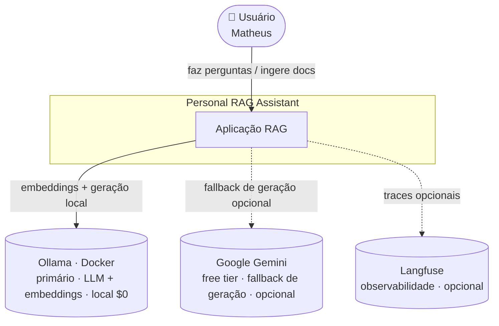

---

## 2. Diagrama de Componentes (C4 — Nível 2/3)
*As camadas internas e como o núcleo depende de interfaces, não de implementações.*

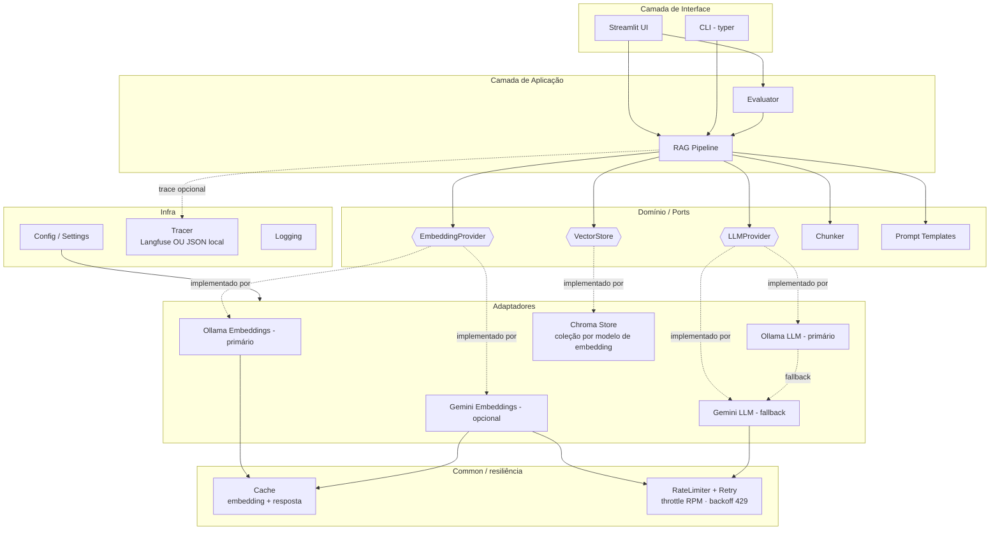

---

## 3. Sequência — Fluxo de Ingestão
*O que acontece quando você indexa uma pasta de documentos.*

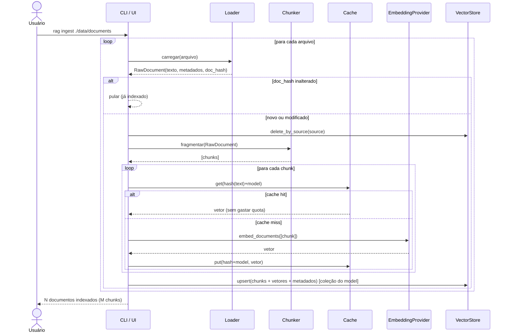

---

## 4. Sequência — Fluxo de Query (RAG)
*O caminho de uma pergunta até a resposta com fontes.*

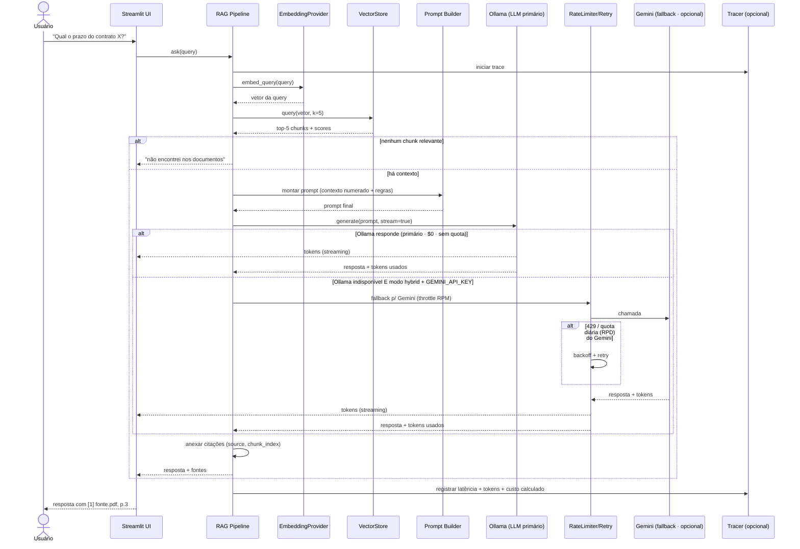

---

## 5. Diagrama de Fluxo de Dados (DFD)
*Como o dado se transforma da entrada bruta até o vetor consultável.*

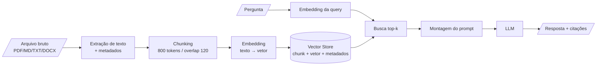

---

## 6. Diagrama ER (modelo conceitual dos dados)
*Modelo mental relacional, mesmo o V1 usando ChromaDB.*

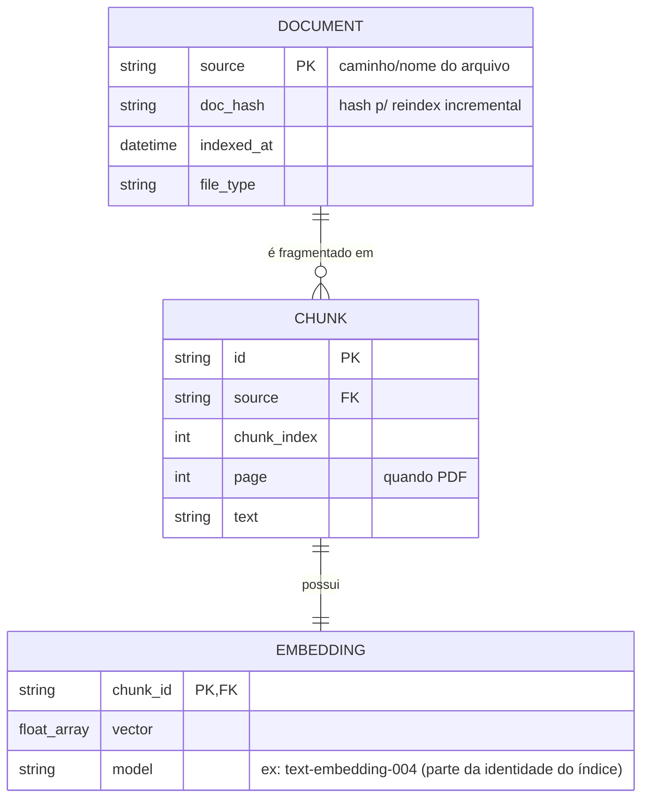

---

## 7. Diagrama de Classes (núcleo)
*As abstrações (Ports) e suas implementações concretas (Adapters).*

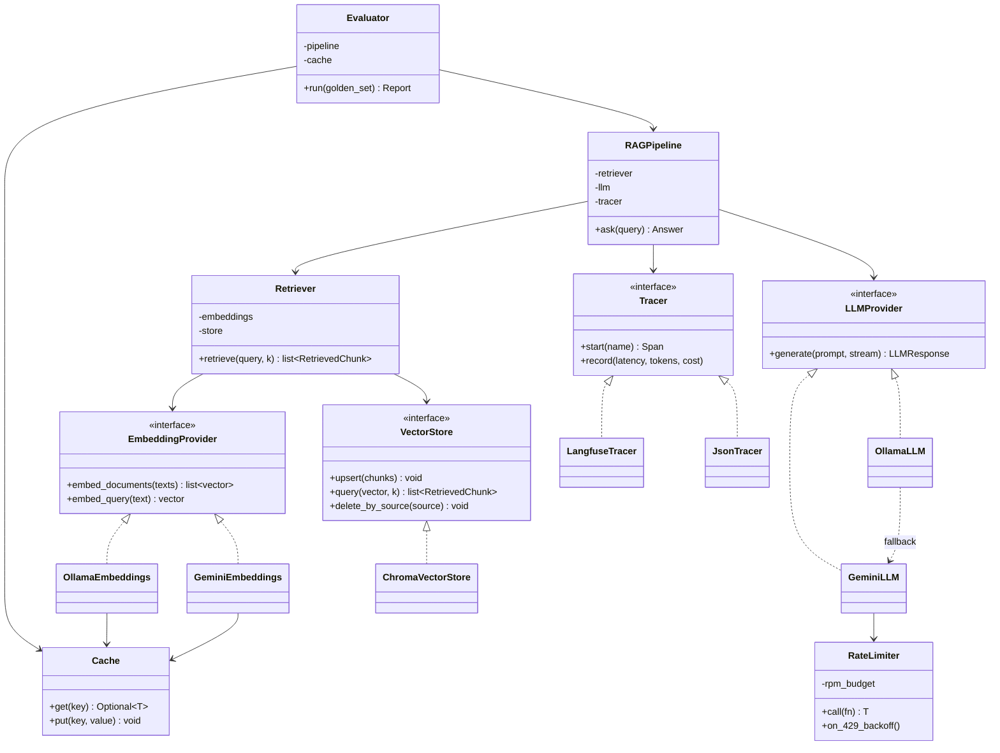

---

## 8. Diagrama de Estados — ciclo de vida de uma query
*Os estados por que uma pergunta passa, incluindo o caminho de "não sei".*

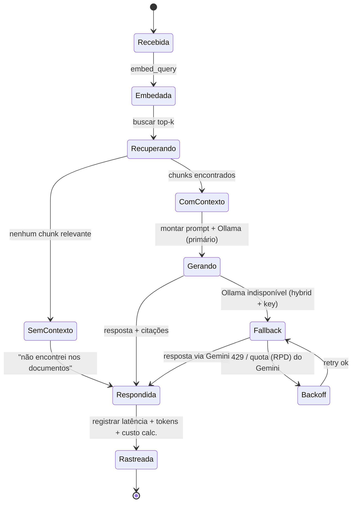

---

## 9. Diagrama de Fases (Gantt do 1º semestre)
*Planejamento temporal — detalhe em `PROJECT_PLAN.md`.*

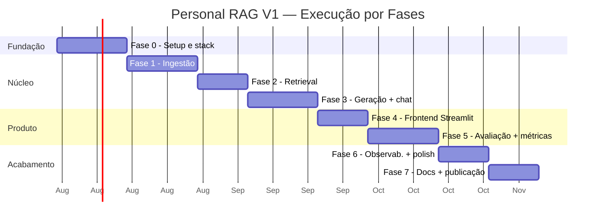

---

## 10. Mapa mental do escopo (V1 vs V2)
*O que entra agora e o que fica pontuado como extensão.*

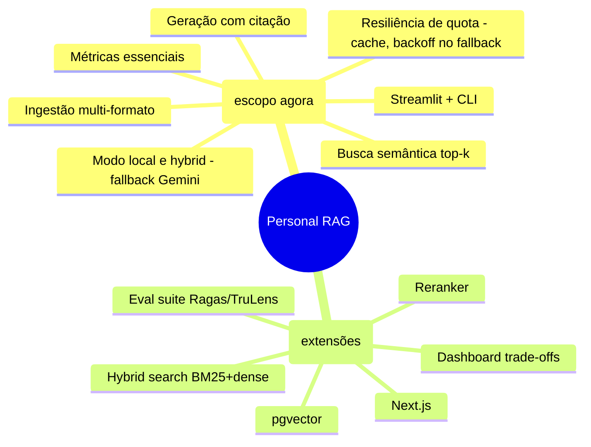

---

## 11. Seleção de Provider & Fallback de Quota
*Como o modo e a quota do free tier decidem qual LLM responde — e o que garante custo $0.*

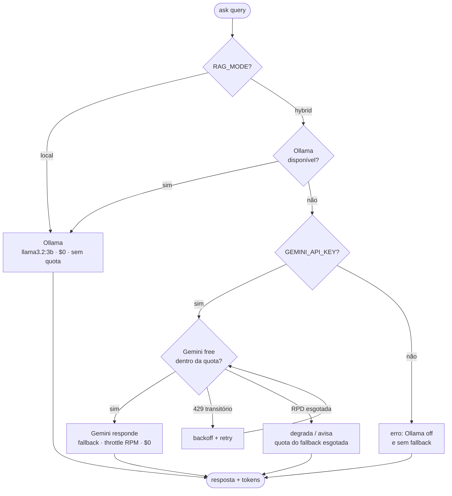

> Regra: nenhum caminho leva a provider pago. Custo real permanece **$0**; o primário Ollama roda offline, $0, sem quota — o pior caso é o fallback Gemini opcional esbarrar na quota diária.

---

*Dica: cole qualquer bloco em [mermaid.live](https://mermaid.live) para editar visualmente.*
