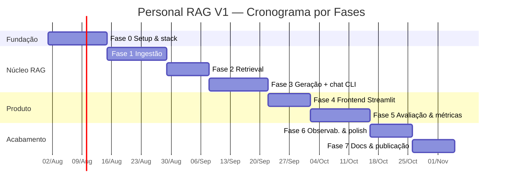

# 🗺️ Plano de Execução por Fases — Personal RAG Assistant V1

> Execução realista de um projeto de 1 semestre, feito **em paralelo** à faculdade e ao trabalho.
> São **8 fases** (Fase 0 a Fase 7). Cada fase entrega algo **funcional e demonstrável** —
> nada de "grande explosão no final". Estimativas em dias corridos assumindo ritmo sustentável
> (algumas horas por semana), não full-time.

---

## 🧭 Princípios de execução

1. **Vertical slices, não camadas isoladas.** Cada fase entrega funcionalidade ponta a ponta.
2. **Sempre demonstrável.** Ao fim de cada fase, dá pra rodar e mostrar algo (commit + print/GIF).
3. **Escopo congelado.** Ideias novas viram issues do V2, não trabalho da fase atual.
4. **Commitar cedo e sempre.** Repositório público desde a Fase 0 (mostra evolução real).
5. **Medir antes de otimizar.** A Fase 5 (avaliação) informa qualquer ajuste posterior.
6. **Custo $0 sempre.** Nenhuma tarefa depende de API paga; free tier + local só.

---

## 📚 Como cada fase está descrita

Toda fase segue o mesmo esqueleto, para não faltar nada:

| Campo | O que é |
|-------|---------|
| **Objetivo** | A frase única que define a fase |
| **Depende de** | O que precisa estar pronto antes de começar |
| **Bibliotecas** | Deps novas que entram nesta fase |
| **Tarefas** | Passo a passo, agrupado, com arquivo/decisão de cada item |
| **Comandos** | O que se digita para rodar/verificar |
| **Testes desta fase** | O que passa a ser coberto por teste |
| **Entregáveis** | O artefato concreto ao fim |
| **DoD** | Checklist testável — só fecha a fase quando tudo ✅ |
| **Riscos da fase** | O que pode dar errado + mitigação |
| **Como demonstrar** | O que vira commit/print/GIF (evolução pública) |

---

## Visão geral das fases

| Fase | Nome | Entrega central | Marco | Duração |
|------|------|-----------------|-------|---------|
| 0 | Fundação & Setup | Stack instalada, repo, "hello LLM" (Ollama primário + Gemini fallback) | Ambiente prova conceito | ~2 sem |
| 1 | Ingestão | Documentos viram chunks indexados (com cache) | `rag ingest` funciona | ~2 sem |
| 2 | Retrieval | Busca semântica top-k funcionando | `rag search` coerente | ~1,5 sem |
| 3 | Geração + Chat | Resposta ancorada com citação (CLI) | `rag ask` com fonte | ~2 sem |
| 4 | Frontend | Interface Streamlit de chat | Primeira demo visual | ~1,5 sem |
| 5 | Avaliação | Golden set + métricas (recall/tokens/latência) | Primeiras métricas reais | ~2 sem |
| 6 | Observabilidade & Polish | Traces, testes, CI, modo local sólido | Sistema confiável | ~1,5 sem |
| 7 | Docs & Publicação | README + demo + repo apresentável + post | ⭐ Gate do semestre | ~1,5 sem |

> **Dependência é linear** (cada fase usa a anterior), **exceto**: a Fase 5 (avaliação) só precisa da Fase 3 (geração), não da 4 (frontend) — dá para adiantar o eval se preferir CLI antes de UI.

---

## 🏁 Fase 0 — Fundação & Setup

**Objetivo:** ambiente de IA montado e um "hello world" que prova que cada provider responde — **de graça**.

**Depende de:** nada (ponto de partida).

**Bibliotecas:** `uv`, `ruff`, `pytest`, `pre-commit`, `pydantic-settings`, `tenacity` (backoff), `python-dotenv` (implícito no pydantic-settings), `langchain-ollama`, `langchain-google-genai`.

**Tarefas**

*Repositório e tooling*
- [ ] Criar repo público, `.gitignore` (ignorar `data/`, `.env`, `.venv`, `__pycache__`, `*.egg-info`), `LICENSE` (MIT).
- [ ] `pyproject.toml` com `uv`: metadados, `requires-python=">=3.11"`, `[project.scripts] rag = "rag_assistant.cli:app"`, config de `ruff` e `pytest`.
- [ ] Estrutura de pastas vazia conforme doc 04 (`src/rag_assistant/...`, `tests/`, `evaluation/`, `docs/`, `scripts/`, `.github/workflows/`).
- [ ] `.pre-commit-config.yaml`: `ruff` (lint + format) + checagens básicas (trailing-whitespace, end-of-file-fixer).
- [ ] `.github/workflows/ci.yml`: `uv sync` → `ruff check` → `pytest` (por enquanto 1 teste dummy verde).

*Providers (local-first, $0)*
- [ ] Subir **Ollama via Docker** (`make ollama-up`, ou `docker compose up -d`) e baixar modelos (`make ollama-pull` → `llama3.2:3b` + `nomic-embed-text`); **medir VRAM** e confirmar que cabe na RTX 5060 8GB.
- [ ] (Opcional) Criar chave grátis no **Google AI Studio** (Gemini) p/ o fallback do modo `hybrid`. Opcional também: **Langfuse** (observabilidade).
- [ ] `.env.example` versionado (sem valores) + `.env` local preenchido (por padrão roda 100% local, sem chave).

*Config e resiliência (bases que todas as fases usam)*
- [ ] `config/settings.py` (pydantic-settings): lê e **valida** `.env` (provider válido, modelos pinados, paths). Avisa/falha cedo se o modo for `hybrid` mas faltar `GEMINI_API_KEY` (fallback desativado); no modo `local` não exige nenhuma chave.
- [ ] `common/ratelimit.py`: decorator/helper com `tenacity` — throttle de RPM + backoff exponencial em `429`/`ResourceExhausted`.

*Prova de conceito*
- [ ] `scripts/hello.py`: manda o mesmo prompt para **Ollama (primário) e Gemini (fallback)** e imprime cada resposta + tokens.

**Comandos**
```bash
uv sync
make ollama-up && make ollama-pull   # sobe Ollama (Docker) + baixa llama3.2:3b e nomic-embed-text
cp .env.example .env                 # opcional: GEMINI_API_KEY p/ o fallback do modo hybrid
uv run python scripts/hello.py
```

**Testes desta fase**
- Unit: `settings.py` valida config inválida (provider inexistente → erro).
- Unit: `ratelimit` faz retry em uma função que simula `429` e desiste depois de N tentativas.

**Entregáveis:** repo inicializado + CI verde + `hello.py` chamando os 3 providers.

**DoD**
- ✅ `uv sync` funciona do zero em máquina limpa.
- ✅ Ollama (primário) e Gemini (fallback opcional) respondem a um prompt.
- ✅ Um `429` do free tier é tratado com backoff (não derruba o script).
- ✅ `ruff` e `pytest` verdes no CI.
- ✅ Nenhuma chave commitada (`git log -p` limpo).

**Riscos da fase**
- ⚠️ **Modelo local não cabe na GPU 8GB** → testar AGORA; se estourar, cair para `llama3.2:1b` ou variante quantizada antes de seguir.
- ⚠️ Nome de modelo Gemini muda → já deixar pinado em `.env` (`GEMINI_LLM_MODEL`).

**Como demonstrar:** commit inicial + print do `hello.py` mostrando 3 respostas; badge de CI verde no README.

---

## 📥 Fase 1 — Ingestão

**Objetivo:** transformar arquivos (PDF/MD/TXT/DOCX) em chunks indexados no vector store, sem reprocessar o que não mudou.

**Depende de:** Fase 0 (config, ratelimit, providers).

**Bibliotecas:** `chromadb` (ou `langchain-chroma`), `pypdf`, `python-docx`, `diskcache` (cache SQLite), `langchain-text-splitters`.

**Tarefas**

*Domínio (sem I/O)*
- [ ] `domain/models.py`: `RawDocument`, `Chunk`, `EmbeddedChunk`, `RetrievedChunk` (dataclasses/pydantic).
- [ ] `domain/ports.py`: `EmbeddingProvider` e `VectorStore` como `Protocol`.
- [ ] `domain/exceptions.py`: `DocumentLoadError`, `EmbeddingMismatchError`.

*Ingestão*
- [ ] `ingestion/loaders.py`: um loader por formato — PDF (`pypdf`, com `page`), DOCX (`python-docx`), MD/TXT (nativo). Todos devolvem `RawDocument` com `source`, `page?`, `doc_hash` (SHA-256 do conteúdo).
- [ ] `ingestion/chunker.py`: `RecursiveCharacterTextSplitter`, `CHUNK_SIZE`/`CHUNK_OVERLAP` da config.

*Adaptadores + cache*
- [ ] `embeddings/gemini_embeddings.py` (`text-embedding-004`) e `embeddings/ollama_embeddings.py` (`nomic-embed-text`) + `embeddings/factory.py`. Adapters de nuvem envoltos por `ratelimit`.
- [ ] `common/cache.py`: cache de embedding com `diskcache`, chave = `sha256(text) + model`. Miss → embeda e grava; hit → devolve vetor sem gastar quota.
- [ ] `vectorstore/chroma_store.py`: `upsert`, `query`, `delete_by_source`. **Nome da coleção = `chunks__<embed_model>`** (§5.6 do SDD). Guardar `model` no metadado.

*Pipeline + CLI*
- [ ] `ingestion/pipeline.py`: `load → (checar doc_hash) → chunk → cache/embed → upsert`. **Reindex incremental**: `doc_hash` inalterado ⇒ pula; mudou ⇒ `delete_by_source` + reindexa.
- [ ] `cli.py`: comando `rag ingest <pasta>` com barra de progresso e resumo (N docs / M chunks / X do cache).

**Comandos**
```bash
uv run rag ingest ./data/documents
# rerun: deve pular arquivos inalterados
uv run rag ingest ./data/documents
```

**Testes desta fase**
- Unit `test_loaders.py`: cada formato extrai texto + metadados; `doc_hash` estável.
- Unit `test_chunker.py`: respeita tamanho/overlap; não corta no meio de palavra além do overlap.
- Contrato `test_vectorstore.py`: `upsert`→`query`→`delete_by_source` num fake/Chroma em memória.
- Unit cache: segundo `embed` do mesmo texto+model não chama o provider (mock conta chamadas).

**Entregáveis:** `rag ingest` persiste chunks no Chroma; rerun é incremental.

**DoD**
- ✅ PDF, MD, TXT **e DOCX** indexam sem erro (todos os formatos do RF-01).
- ✅ Rerun não reprocessa arquivos inalterados (cache + `doc_hash`).
- ✅ Coleção reflete o modelo de embedding; consultar com embedder diferente dá erro claro (`EmbeddingMismatchError`).
- ✅ Testes de chunker, loaders, cache e contrato do store passando.

**Riscos da fase**
- ⚠️ PDF com layout ruim/scan → texto lixo. Mitigação: logar arquivos com texto quase vazio; scan/OCR fica fora do V1.
- ⚠️ Ingestão grande estoura quota de embedding do Gemini → cache + usar Ollama (`nomic`, local, sem quota) para bases grandes.

**Como demonstrar:** print do `rag ingest` mostrando N docs/M chunks e a segunda rodada pulando tudo (incremental).

---

## 🔍 Fase 2 — Retrieval

**Objetivo:** dada uma pergunta, recuperar os trechos mais relevantes (top-k) com score e fonte.

**Depende de:** Fase 1 (índice populado).

**Bibliotecas:** nenhuma nova.

**Tarefas**
- [ ] `retrieval/retriever.py`: `embed_query(query)` → `store.query(vetor, k)` → `list[RetrievedChunk]` (texto + score + `source` + `chunk_index` + `page?`).
- [ ] `TOP_K` configurável via `.env`.
- [ ] **Validação de compatibilidade**: no boot do retriever, conferir que o embedder configurado bate com o modelo da coleção; senão erro claro pedindo reindex.
- [ ] `cli.py`: `rag search "pergunta"` imprime os k chunks + score + fonte (modo debug).

**Comandos**
```bash
uv run rag search "Qual o prazo de entrega do contrato X?"
```

**Testes desta fase**
- Integração `test_rag_pipeline.py` (parte retrieval): ingerir doc de exemplo → `search` traz o chunk esperado no top-k.
- Unit: `EmbeddingMismatchError` quando embedder ≠ modelo da coleção.

**Entregáveis:** `rag search` retorna trechos coerentes com a pergunta.

**DoD**
- ✅ Para perguntas óbvias, o chunk correto aparece no top-5.
- ✅ Teste de integração ingest→retrieve verde (store em memória).
- ✅ Score e fonte visíveis no output.

**Riscos da fase**
- ⚠️ Recall baixo por chunking ruim → não otimizar no escurinho; deixar para a Fase 5 medir e então ajustar `CHUNK_SIZE`/`TOP_K`.

**Como demonstrar:** print do `rag search` com os trechos + score, provando busca semântica (pergunta com sinônimos ainda acha o trecho).

---

## 💬 Fase 3 — Geração + Chat (CLI)

**Objetivo:** resposta em linguagem natural **ancorada** nos trechos, com **citação** — no modo `local` (Ollama) e `hybrid` (Ollama primário + fallback Gemini).

**Depende de:** Fase 2 (retrieval).

**Bibliotecas:** nenhuma nova (LLM adapters usam as libs da Fase 0).

**Tarefas**

*Ports + adapters de LLM*
- [ ] `domain/ports.py`: `LLMProvider.generate(prompt, *, stream)` + `LLMResponse(text, input_tokens, output_tokens, model)`.
- [ ] `llm/ollama_llm.py` (Llama 3.2, local — **primário**), `llm/gemini_llm.py` (`gemini-2.5-flash-lite` — **fallback de geração**) + `llm/factory.py`. O adapter de nuvem (Gemini) usa `ratelimit` (throttle RPM + backoff 429); fallback Ollama→Gemini quando o Ollama está indisponível (modo `hybrid` + chave).

*Núcleo RAG*
- [ ] `rag/prompts.py`: template com regras — "responda só com base no contexto", "se não estiver no contexto, diga que não sabe", "cite pelo número `[n]`". Contexto injetado como blocos numerados.
- [ ] `rag/citations.py`: mapeia a resposta → fontes (`source`, `chunk_index`, `page?`).
- [ ] `rag/pipeline.py`: `RAGPipeline.ask(query)` orquestrando `retrieve → montar prompt → generate → citar`. Suporte a **streaming** (token a token). Caso "sem contexto relevante" → responde que não encontrou (curto-circuito, sem chamar LLM à toa).

*CLI*
- [ ] `cli.py`: `rag ask "pergunta"` com resposta + fontes; flag `--stream`.

**Comandos**
```bash
uv run rag ask "Qual o prazo de entrega do contrato X?"
LLM_PROVIDER=ollama uv run rag ask "Resuma o documento Y"   # troca por env
```

**Testes desta fase**
- Contrato `test_llm_provider.py`: cada adapter cumpre o `Protocol` (com fake/mocked, sem gastar quota).
- Unit `test_prompts.py`: template injeta contexto numerado e as regras.
- Integração: `ask` sobre doc de exemplo retorna resposta com ao menos uma fonte; pergunta fora do corpus retorna "não encontrei".

**Entregáveis:** `rag ask` responde citando arquivo/trecho, nos modos `local` e `hybrid`.

**DoD**
- ✅ Resposta sempre traz ao menos uma fonte quando há contexto.
- ✅ Sem contexto ⇒ "não encontrei nos documentos" (sem alucinar).
- ✅ Trocar `LLM_PROVIDER` entre ollama/gemini só no `.env` funciona.
- ✅ Streaming imprime tokens progressivamente.

**Riscos da fase**
- ⚠️ Modelo ignora a regra de citar → reforçar no template + validar no código que há fonte; se faltar, marcar a resposta como "sem fonte" em vez de fingir.
- ⚠️ Ollama indisponível no meio de uma sessão → fallback Gemini (modo `hybrid` + chave); quota do Gemini estourar → volta ao Ollama local (primário, sem quota).

**Como demonstrar:** print/asciinema do `rag ask` respondendo com `[1] contrato.pdf, p.3`, e o mesmo comando rodando em Ollama (offline).

---

## 🖥️ Fase 4 — Frontend (Streamlit)

**Objetivo:** interface de chat usável — o que aparece no GIF do README.

**Depende de:** Fase 3 (pipeline `ask`).

**Bibliotecas:** `streamlit`.

**Tarefas**
- [ ] `app/streamlit_app.py` com abas **Chat**, **Ingestão**, **Métricas** (placeholder até a Fase 5).
- [ ] Chat: histórico da sessão (`st.session_state`) + **streaming** da resposta.
- [ ] Fontes exibidas de forma expansível (`st.expander`) mostrando o trecho citado.
- [ ] Sidebar: seletor de **modo** (`local`/`hybrid`) e de **provider**; refletir a config sem reiniciar o app.
- [ ] Aba Ingestão: selecionar pasta / upload + botão "Indexar" com feedback de progresso.
- [ ] Indicador de provider ativo (ex.: "usando Ollama local · fallback Gemini se `hybrid`").

**Comandos**
```bash
uv run streamlit run src/rag_assistant/app/streamlit_app.py
```

**Testes desta fase**
- Smoke manual (checklist): perguntar, ver streaming, abrir fonte, trocar modo, indexar pasta.
- (Opcional) teste leve da função que monta o histórico/estado, isolada do Streamlit.

**Entregáveis:** app web em `localhost` com chat funcional.

**DoD**
- ✅ Dá para perguntar, ver a resposta em streaming e abrir as fontes.
- ✅ Trocar de modo no sidebar funciona sem reiniciar.
- ✅ Aba Ingestão indexa uma pasta e dá feedback.

**Riscos da fase**
- ⚠️ Rerun do Streamlit reinstancia objetos caros (cliente Chroma/LLM) → usar `@st.cache_resource`.

**Como demonstrar:** **GIF** de uma pergunta → resposta em streaming → fonte expandida. É o GIF que vai pro README (Fase 7).

---

## 📊 Fase 5 — Avaliação & Métricas

**Objetivo:** o diferencial do projeto — **medir** qualidade, tokens, custo e latência, de forma reproduzível.

**Depende de:** Fase 3 (pipeline). *Não* depende da Fase 4.

**Bibliotecas:** nenhuma nova (usa cache da Fase 1); gráficos com o próprio Streamlit/`matplotlib` se quiser.

**Tarefas**
- [ ] `scripts/build_golden_set.py` + `evaluation/golden_set.json`: **30 perguntas** com `fonte_esperada` (arquivo/trecho).
- [ ] `evaluation/metrics.py`: **Recall@5**, **tokens/query**, **custo calculado** (USD equiv. tier pago, via tabela de preços), latência (retrieval vs geração separadas).
- [ ] `evaluation/evaluator.py`: roda o golden set ponta a ponta com **`temperature=0`** e **modelo pinado** (reproduzível); usa o **cache** para reruns não gastarem quota; loga quantas queries consumiram RPD.
- [ ] `evaluation/report.py`: gera `evaluation/reports/report.md` + `report.json`.
- [ ] `cli.py`: `rag eval`.
- [ ] Aba **Métricas** no Streamlit: rodar eval + gráficos (latência, Recall@5, tokens).
- [ ] `docs/EVALUATION.md`: metodologia (como o golden set foi montado, o que Recall@5 mede e não mede).

**Comandos**
```bash
uv run rag eval                 # roda golden set, gera report.md/json
uv run rag eval --provider ollama
```

**Testes desta fase**
- Unit `test_metrics.py`: Recall@5 com casos conhecidos (fonte no top-5 / fora); cálculo de custo por tokens.
- Determinismo: rodar o eval duas vezes com cache dá o mesmo resultado e **zero** novas chamadas na segunda.

**Entregáveis:** relatório com números reais local (Ollama) vs fallback (Gemini).

**DoD**
- ✅ `rag eval` produz Recall@5, tokens/query, custo *calculado* e latência média (custo real = $0).
- ✅ Rerun do eval **não** estoura a quota do free tier (cache funcionando).
- ✅ Recall@5 ≥ 0,80 — senão, iterar `CHUNK_SIZE`/`TOP_K` (é para isso que a métrica existe).
- ✅ Números colados no README.

**Riscos da fase**
- ⚠️ 30 perguntas × 2 modos × iterações estoura RPD → cache obrigatório + espaçar rodadas + usar Ollama para iterar de graça.
- ⚠️ Golden set enviesado (perguntas fáceis demais) → incluir perguntas parafraseadas e fora do corpus (deve dar "não sei").

**Como demonstrar:** tabela do `report.md` no README (Gemini vs Ollama) + gráfico da aba Métricas.

---

## 🔭 Fase 6 — Observabilidade & Polish

**Objetivo:** deixar o sistema confiável, o modo local sólido e a resiliência de quota testada.

**Depende de:** Fases 3–5 (há o que observar e testar).

**Bibliotecas:** `langfuse` (opcional), `structlog`, `pytest-cov`.

**Tarefas**
- [ ] `observability/tracer.py`: interface `Tracer`; `LangfuseTracer` (se houver keys) **ou** `JsonTracer` (fallback → `data/traces/`). Traça query, chunks, prompt final, resposta, tempos e tokens.
- [ ] `observability/logging.py`: logging estruturado (`structlog`), JSON em prod, legível em dev.
- [ ] Fechar cobertura de testes de **domínio** e **RAGPipeline** (unit + contract). **CI só com fakes — sem API real nem quota.**
- [ ] Endurecer **modo 100% local**: teste/marcação que garante zero chamadas de rede (mock de socket ou flag que proíbe adapters de nuvem).
- [ ] Endurecer **resiliência de quota**: testes do backoff/retry e do fallback Ollama→Gemini (simulando Ollama indisponível + `429` do Gemini).
- [ ] Tratamento de erros amigável: arquivo corrompido, provider fora do ar, quota esgotada, Ollama não rodando.
- [ ] CI: `ruff` + `pytest` + cobertura em cada PR (badge no README).

**Comandos**
```bash
uv run pytest --cov=rag_assistant
uv run pytest -m local_only     # garante zero rede
```

**Testes desta fase**
- Unit/contract fecham as camadas de domínio e pipeline.
- Teste de resiliência: Ollama indisponível → fallback Gemini; `429` simulado → backoff.
- Teste "sem rede": modo local não abre socket externo.

**Entregáveis:** traces visíveis (Langfuse ou JSON local) + suíte verde no CI.

**DoD**
- ✅ Cada query gera um trace consultável (mesmo sem Langfuse).
- ✅ Modo local não faz nenhuma requisição de rede (verificado por teste).
- ✅ Fallback testado (Ollama off → Gemini; 429 → backoff).
- ✅ CI verde sem tocar em API paga/quota (fakes). Cobertura reportada.

**Riscos da fase**
- ⚠️ Testes "quase-integração" ficarem flaky por dependerem de Ollama/rede → isolar com fakes; Ollama só em teste manual/local.

**Como demonstrar:** screenshot de um trace (Langfuse ou JSON) + badge de cobertura no README.

---

## 📚 Fase 7 — Documentação & Publicação

**Objetivo:** transformar o projeto em **peça de portfólio** que recruta.

**Depende de:** tudo (é o acabamento).

**Bibliotecas:** nenhuma (ferramenta de GIF, ex.: ScreenToGif/asciinema).

**Tarefas**
- [ ] README final com screenshots + **GIF de uso** (`docs/assets/demo.gif`) da Fase 4.
- [ ] Métricas reais preenchidas no README (tabela da Fase 5).
- [x] **Docs em `docs/`** (`SDD.md`, `DIAGRAMS.md`, `PROJECT_STRUCTURE.md`, `PROJECT_PLAN.md`, `OVERVIEW.md`, `EVALUATION.md`), só o `README.md` na raiz. Links relativos ajustados.
- [ ] Revisar textos, badges (CI, cobertura, licença), licença.
- [ ] Post técnico no LinkedIn: o que construiu, decisões (Ports&Adapters, local-first com Ollama), métricas.
- [ ] Atualizar LinkedIn/headline: "AI Engineer | Building with LLMs".
- [ ] (Opcional, recomendado p/ público US) **versão EN do README**.

**Comandos**
```bash
# checar que os links dos docs movidos não quebraram
uv run python scripts/check_links.py   # (opcional)
```

**Entregáveis:** repo público apresentável + post técnico.

**DoD (gate de saída do 1º semestre)**
- ✅ Repositório público com README detalhado e **demo (GIF)**.
- ✅ Métricas publicadas (Gemini vs Ollama).
- ✅ Funciona nos modos `local` e `hybrid`, a **custo $0**.
- ✅ CI verde + cobertura.
- ✅ Post de divulgação feito.

**Riscos da fase**
- ⚠️ Mover docs quebra links internos → varredura de links antes de commitar.
- ⚠️ Deixar a doc em PT afasta recrutador US → gerar README EN (mesmo que os docs internos fiquem em PT).

**Como demonstrar:** o próprio repo público + o post. Este é o marco ⭐ do semestre.

---

## 📅 Cronograma (Gantt)



> As datas são âncora — ajuste o `2026-08-01` para o início real do seu 1º semestre.
> Lembrete: a Fase 5 depende só da Fase 3; se quiser, roda em paralelo à Fase 4.

---

## 🎯 Marcos que importam

| Marco | Acontece em |
|-------|-------------|
| Primeiro "hello LLM" nos 3 providers | Fim da Fase 0 |
| Primeiro `rag ingest` incremental | Fim da Fase 1 |
| Primeiro `rag ask` respondendo com fonte | Fim da Fase 3 |
| Primeira demo visual (Streamlit) | Fim da Fase 4 |
| Primeiras **métricas reais** | Fim da Fase 5 |
| ⭐ **Repo público + README + post** (gate do semestre) | Fim da Fase 7 |

---

## ✅ Checklist global de "pronto para publicar"

Só considere o V1 fechado quando **tudo** abaixo for verdade (espelha o doc 00):

- [ ] Repositório público com README detalhado (screenshots + GIF).
- [ ] Ingestão funciona para PDF, MD, TXT e DOCX.
- [ ] Chat responde com citação da fonte (arquivo + trecho).
- [ ] Funciona em dois modos: `local` (100% Ollama) e `hybrid` (Ollama + fallback Gemini).
- [ ] Métricas publicadas: latência, tokens/query, custo calculado, Recall@5 sobre 30 perguntas.
- [ ] Testes automatizados + CI verde (sem gastar quota).
- [ ] Resiliência de quota (backoff, cache, fallback) testada.
- [ ] Config por `.env`; nenhuma chave commitada; custo real = **$0**.

---

## 🔄 Ponte para o V2 (2º semestre)

Cada item abaixo já tem seu ponto de extensão preparado no código do V1:

| Extensão V2 | Onde encaixa |
|-------------|--------------|
| Hybrid search (BM25 + dense) | Novo retriever atrás da mesma interface |
| Reranker (Cohere/cross-encoder) | Passo extra no `RAGPipeline` pós-retrieval |
| Eval suite (Ragas/TruLens, MRR/NDCG/faithfulness) | Expande `evaluation/metrics.py` |
| pgvector | Implementar `pgvector_store.py` (stub já existe) |
| Frontend Next.js | Substitui a camada `app/`, pipeline intacto |

> É por isso que o V1 foi desenhado com Ports & Adapters: o V2 **evolui**, não reescreve.

---

*Plano alinhado ao SDD (doc 01) e à estrutura (doc 04). Documento vivo — marque as caixas conforme avança.*
